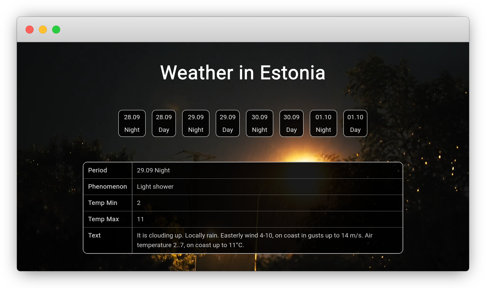

# Weather Forecast in Estonia

[](https://github.com/chaosrun/estonian-weather/actions/workflows/build.yml) [](https://weather.chaos.run) [](https://weather.chaos.run/api/forecast)

This is a weather forecast web app for Estonia. It uses the [Estonian Environment Agency XML Service](https://www.ilmateenistus.ee/ilma_andmed/xml/forecast.php?lang=eng) to fetch the weather data. The backend can provide API for the weather data in JSON format, please see the [API endpoints](#endpoints) section. The frontend design is responsive and works on mobile devices.



## Installation

The app can be deployed using Docker. First, clone the repository:

```bash
git clone https://github.com/chaosrun/estonian-weather.git
```

Then, enter the directory and edit the `.env` file to set environment variables:

```bash
cd estonian-weather
cp .env.example .env
vim .env
```

Finally, run the Docker container:

```bash
docker-compose up -d
```

The web app will be available at `http://localhost:{SERVER_PORT}`.

## Development

### Justification

The application will not re-fetch the online XML file every time a user accesses the forecast page, because frequent consumption of XML is unnecessary and increases latency. The program fetches the data from the online XML every 10 minutes and updates the data to the database.

### Tech Stack

- [Spring Boot](https://spring.io/projects/spring-boot)
- [Vue.js](https://vuejs.org/)
- [PostgreSQL](https://www.postgresql.org/)
- [Docker](https://www.docker.com/)

### Modelling

Below is a class diagram of the backend.


### Endpoints

| URI                        | METHOD | DESCRIPTION                                                                                  |
|----------------------------|--------|----------------------------------------------------------------------------------------------|
| /api/forecast              | GET    | Get forecasts for next 4-days                                                                |
| /api/forecast/refresh      | GET    | Get forecasts for next 4-days, forcing to fetch data from XML source                         |
| /api/forecast/dates        | GET    | Get most recent available forecast dates                                                     |
| /api/forecast/date/{date}  | GET    | Get day and night forecast by specifying a date (can retrieve history forecasts in database) |
| /api/forecast/night/{date} | GET    | Get night forecast by specifying a date                                                      |
| /api/forecast/day/{date}   | GET    | Get day forecast by specifying a date                                                        |                                              |

### Database

The app uses a PostgreSQL database. You can create the development database with the following commands:

```bash
sudo -u postgres psql
```

```sql
create database ootdb;
create user oot with encrypted password 'oot';
grant all privileges on database ootdb to oot;
```

## License

[Gnu General Public License v3.0](LICENSE)
